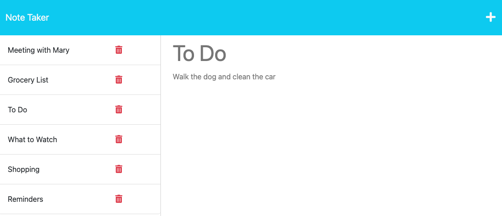

# note-taker

## Description

Note Taker is an Express.js program that allows the user to take notes and keep track of what needs to be done via Express.js. These notes taken are also available to be referred to again by clicking on the previous notes listed on the page. 

I was able to demonstrate what I have learned throughout the Carleton University Full Stack Coding Bootcamp as well as use my researching skills to find and complete this program.

## Installation

You will need to install [node.JS](https://nodejs.org/en/download) to run the README Generator. 

You will also have to run command in node.JS terminal >> npm install

## Usage

1. When you run npm start, the app will listen to port 3001 (ensure you have no other programs running on that port).
2. You can then open [http://localhost:3001](http://localhost:3001) in your browser to view the program. 
3. Click Get Started on the homepage to open the note taking section of the site. 
4. From here, you can add new notes, view previous notes and delete unnecessary notes. 
5. You can visit the [deployed site here](https://mdeluca13-notetaker.herokuapp.com/).

## Credits

Base Code for HTML and CSS supplied by CARL-VIRT-FSF-PT-01-2023-U-LOLC GitLab Repository.

## License

The License used was the [MIT License](https://choosealicense.com/licenses/mit/). Also found in repository under LICENSE.

## Questions

If you have any questions, please reachout via [GitHub](https://github.com/mdeluca13/).
